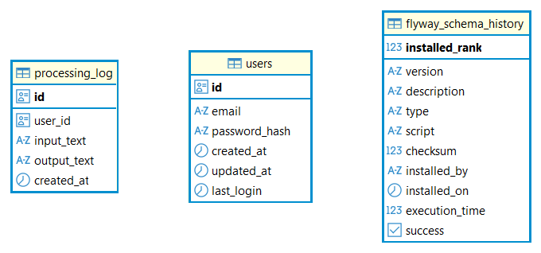

### Database Structure
#### ER Diagram



--- 

### users
|Column|Type|Description|
|-----|------|-------|
|id	|UUID	|Primary key|
|email	|VARCHAR	|Unique user email|
|password_hash	|VARCHAR	|Encrypted password|
|created_at	|TIMESTAMP	|Account creation time|
|updated_at	|TIMESTAMP	|Last update time|
|last_login	|TIMESTAMP	|Last successful login|

Indexes:
- `idx_users_email` (email lookup for authentication)

Entity:  
➡ [User](https://github.com/valeriinikolaichuk/winwin_travel_task/blob/main/auth-api/src/main/java/com/winwin/auth_api/user/entity/User.java)

---

### processing_log
|Column|Type|Description|
|-----|------|-------|
|id	|UUID	|Primary key|
|user_id	|UUID	|Reference to user (logical relation)|
|input_text	|TEXT	|Original request|
|output_text	|TEXT	|Response from data-api|
|created_at	|TIMESTAMP	|Processing timestamp|

Indexes:
- `idx_processing_log_user_id` (fast lookup by user)

Entity:  
➡ [ProcessingLog](https://github.com/valeriinikolaichuk/winwin_travel_task/blob/main/auth-api/src/main/java/com/winwin/auth_api/log/entity/ProcessingLog.java)

---

### Relationships
- A user can have many processing logs
- Relationship is maintained via `user_id` (UUID reference, no FK constraint)

### Notes
- UUID is used for all primary keys for scalability
- No JPA relations are used to keep services simple and decoupled
- Indexes are added for performance on authentication and log queries
- Schema is managed via `Flyway` migrations

### Exposed on:

```text
localhost:5434
